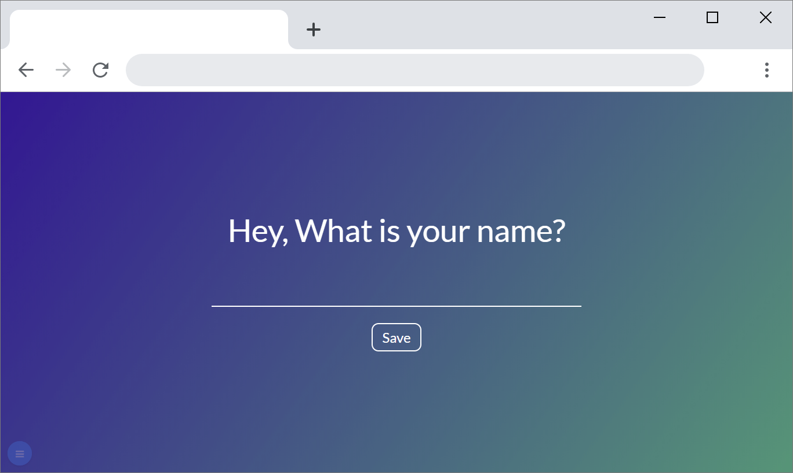
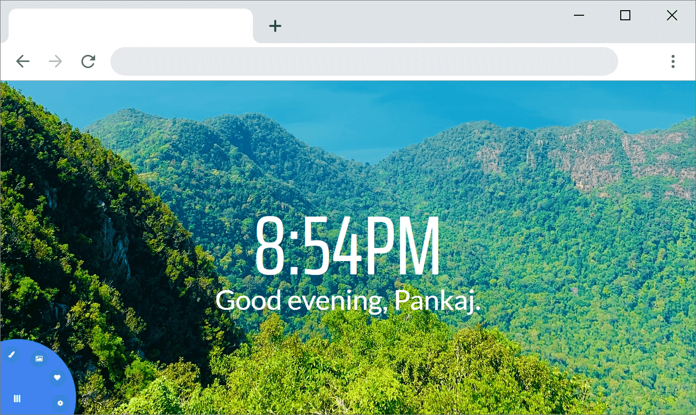
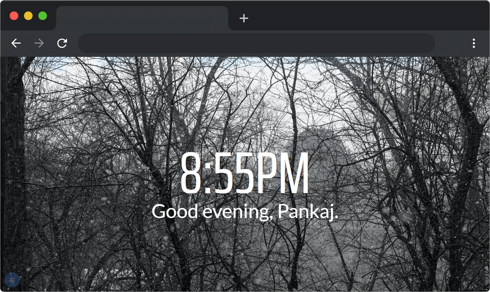
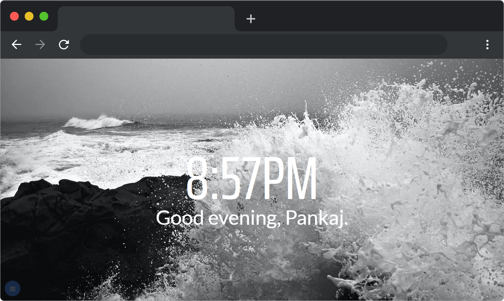
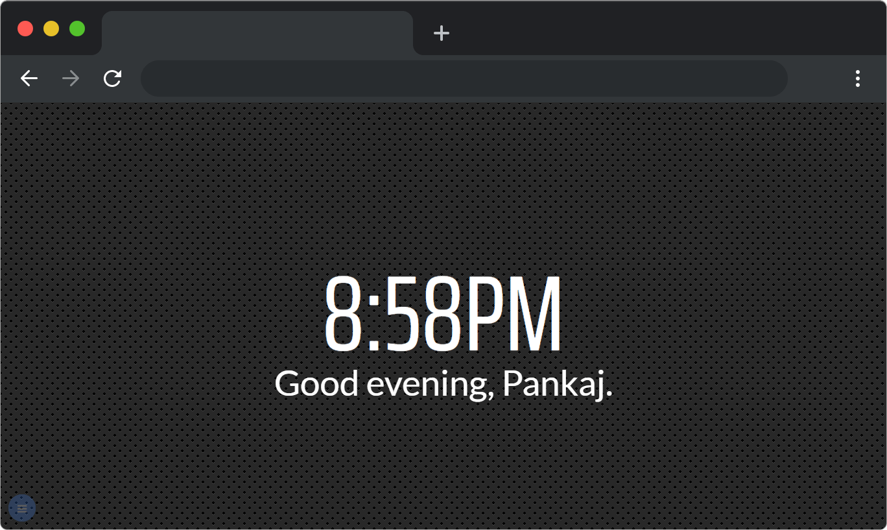
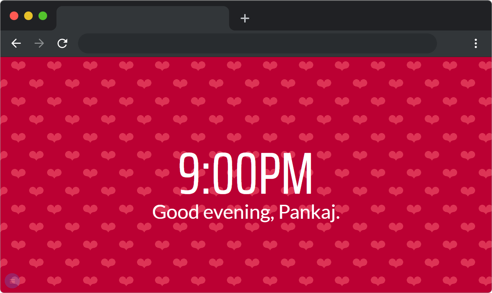

<h1 align="center">
   
  
   
  BrandNewTab
   
</h1>

<h4 align="center">Change new tab with beautiful images, gradients, or patterns</h4>

<h1/>

<h1 align="center">

  

</h1>

## Demo
Here is a working live demo : <i>TODO</i>

## Screenshots

### Gradient as background

### Image as background

### Pattern as background

