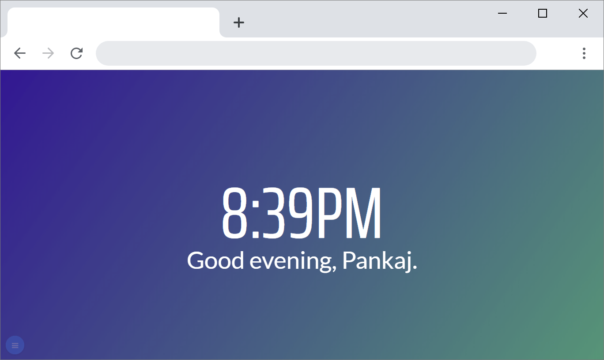

<h1 align="center">
   
  
    
  
  **BrandNewTab**
   
</h1>

<h4 align="center">

**Change new tab with beautiful images, gradients, or patterns** 

 

 
 

</h4>

<h1/>

<h1 align="center">

  

</h1>

## Demo 
Here is a working live demo : [Brand New Tab](https://pankajrpandey.github.io/BrandNewTab/) 

## Try this extension in developer mode

**Follow these steps to run BrandNewTab in Google Chrome or latest Microsoft Edge as a developer.**

- Clone this repo or Download & unzip repo
- Open url    
  ``chrome://extensions/`` in Google Chrome OR   
  ``edge://extensions/`` in Microsoft Edge.
- Click on _Developer mode_ toggle button so that you can see developer options.
- Click on the **Load unpacked** button
- Browse to the location where this repo (BrandNewTab folder) is saved/cloned and select it as the extension directory.

<strong>Follow these steps to run BrandNewTab in Mozilla Firefox as a developer.</strong>

- Clone this repo or Download & unzip repo
- Open url    
  ``about:debugging#/runtime/this-firefox`` in Mozilla Firefox  
- Click on the **Load Temporary Add-on…** button
- Browse to the location where this repo (BrandNewTab folder) is saved/cloned and select ``manifest.json`` file as the Add-on file.

## Screenshots

### Gradient as background

### Image as background

### Pattern as background

